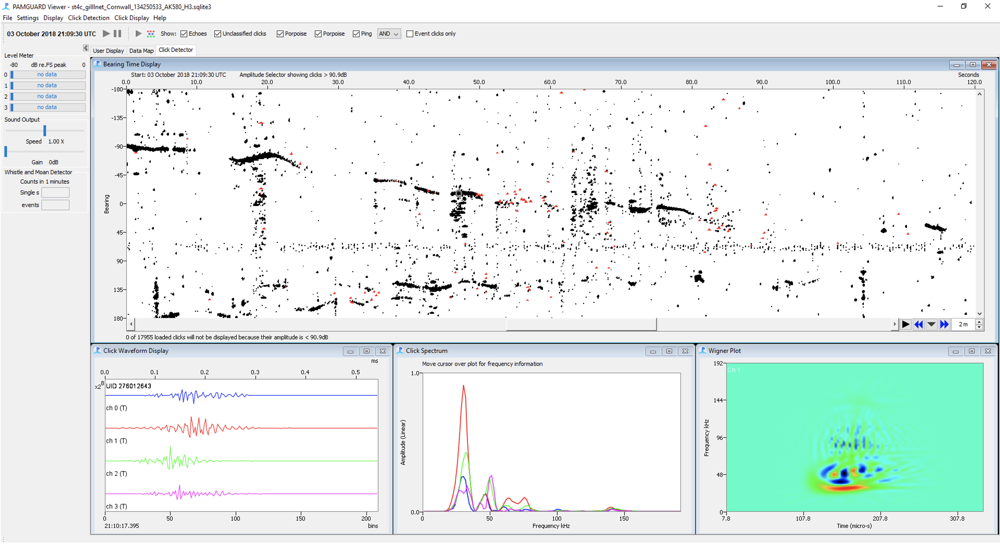
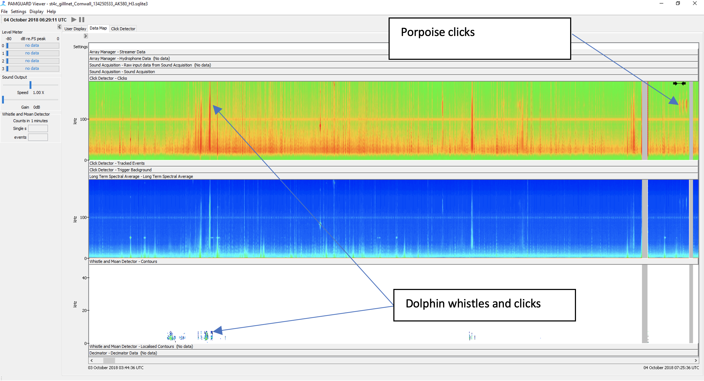

# PAMGuard

PAMGuard website: [www.pamguard.org](http://www.pamguard.org)

## Introduction
PAMGuard is a bioacoustics analysis program designed for use in real time research contexts and for the processing of large datasets. PAMGuard provides users access to a suite of state-of-the-art automated analysis algorithms alongside displays for visualisation data and a comprehensive data management systems. 

## Why do we need PAMGuard?
PAMGuard fulfils two main requirements within marine bioacoustics

1) **Real time operation**: Almost all PAMGuard features and modules work in real time - this allows scientists and industry to detect, classify and localise the position of animals in real time on a standard consumer laptop, enabling mitigation and research surveys without expensive bespoke software solutions and the transparency of open source software.  

2) **Processing and visualisation of large datasets**: Off-the-shelf autonomous PAM devices, large scale surveys involving drifters, towed arrays, gliders, bottom mounted devices and real time continuous monitoring system all generate huge volumes of data which requires automated analysis approaches. PAMGuard allows the processing of very large passive acoustic datasets using automated algorithms and crucially provides comprehensive visualisation tools for a manual analyst to check the results.

## Installation
PAMGuard is available on Windows and can be downloaded from the [PAMGuard website](https://pamguard.org). Note that we are considering MacOS and Linux installers but they are not available at this time. 

## Quick start tutorial
PAMGuard is a modular program with two modes; real-time and viewer. Typically a user will start with real-time model, either in the field collecting data or post processing sound files from a recorder. Once data are processed, users move on to viewer mode where data can be explored and further processed. 

Upon opening PAMGuard for the first time you are greeted with a blank screen. You must add a series of modules to create the desired acoustic workflow - this is referred to as PAMGuard *data model*. For example if processing sound files then first add the Sound Acquisition module **_File->Add Modules->Sound Processing->Sound Acquisition_**. Then add the desired detection algorithms e.g.  **_File->Add Modules->Detector->Click Detectors_**. Some modules (such as the click detector) have their own bespoke displays, others are added to more generalised displays. For example, the whistle and moan detector module shows detections on a spectrogram display, time base display, map etc. First add a new tab using  **_File->Add Modules->Displays->User Display_**. Click on the user display tab and then from the top menu select **_User display-> New Spectrogram_**. Right click on the added spectrogram and select whistle and moan contours to show whistle detections overlaid on the raw spectrogram. 

Make sure to add the database and binary file storage modules **_File->Add Modules->Utilities->..._**) to save data then press the run button (red button) and data will process. PAMGuard can handle huge datasets so running might take hours or even days. Progress is shown on the bottom of the screen. 

Once the data has run, open PAMGuard viewer mode. Select the database you used to process the data along and the binary file storage path and PAMGuard will open, showing an overview of the dataset in a new _Data map_ tab. Right click anywhere on the data map and select "Center data here" - PAMGuard will load the data for the selected period which can be explored using whichever displays have been added to the data model. 

## Features
### Hardware integration
PAMGuard connects with hardware such as various GPS and AIS systems and a multitude of different sound cards (e.g. [National Instruments](https://ni.com) devices, [SAIL DAQ cards](https://smruconsulting.com/contact-us), almost all ASIO sound cards and standard computer sound cards) for real time data collection and processing. PAMGuard also works with some very bespoke hardware such as [DIFAR Sonobuoys](https://pubs.aip.org/asa/jasa/article/139/3/EL83/910724);

### Real time operation
PAMGuard takes advantage of multi-core processors to run multiple signal processing automatic analysis algorithms in real time to detect whales, dolphins, bats etc. Data are shown in different displays, including interactive spectrograms and maps. You might be using PAMGuard for simply viewing a spectrogram and making recordings or running deep learning algorithms for multiple species and localising the results to view locations on a map. Whatever acoustic workflow a user creates, PAMGuard can run it in real time. 

### Support for compressed audio
PAMGuard supports processing audio data from standard files (e.g. wav, aif) and also compressed files (e.g. .flac and .sud). Note that sud files are created on SoundTraps widely used marine recorders and can be read by PAMGuard without decompressing - PAMGuard will automatically import click detections if present in sud files. PAMGuard also supports importing detection data from CPODs and FPODs. 

### Comprehensive data management system
PAMGuard is designed to collect/process data from large acoustic datasets. PAMGuard stores data in an SQLite databases and "Binary" files. The database stores important metadata such as when data has been processed and some low volume data streams such as GPS. Binary files are not human readable but efficient to access - PAMGuard stores detection data (e.g. clicks, whistles, noise, etc) in these files. This allows PAMGuard to rapidly access data from large datasets. Data from binary files can be viewed in PAMGuard viewer mode or can be exported to MATLAB using the [PAMGuard-MATLAB](https://github.com/PAMGuard/PAMGuardMatlab) library or the exported to R using the R [PAMBinaries](https://github.com/TaikiSan21/PamBinaries) package. 

### Access to detection and classification algorithms
PAMGuard allows users to integrate automated detection and classification algorithms directly into their acoustic workflow. There are a multitude of different algorithms to choose from, including a basic click detector, whistle and moan detector, GPL detector, click train detectors and many others. The idea behind PAMGuard is allow researchers to access open source state-of-the-art algorithms developed within the scientific community - if you want to contribute and get your algorithm into PAMGuard get in touch. 

_The PAMGuard click detector can be used to detect transient sounds such as echolocation clicks. It also automatically localises click bearings for closely spaced hydrophones._

### Localisation
PAMGuard has a multitude of different options for acoustic localisation. There's a comprehensive beam forming module for beam forming arrays, a large aperture localiser for 3D localisation and target motion analysis for towed hydrophone arrays. 

### Soundscape analysis
PAMGuard has a noise band (which supports third octave noise bands) and long term spectral average module for soundscape analysis. 

### GIS
Almost all detection data can be visualised on a map. PAMGuard also supports plotting GPS and AIS data. 

### Suite of data visualisation tools
An important aspect of PAMGuard is the ability for users to explore processed data. PAMGuard allows users to visualise data at multiple different times scales, from inspecting individual waveforms microseconds long to datagrams showing detector output or soundscape metrics over days, weeks or even years.

_The PAMGuard data map provides an overview of the entire processed dataset over days, weeks and even years._

### Advanced manual annotation
The displays within PAMGuard support a variety of manual annotation tools. Users can add data to annotations in multiple ways, from simple text annotations to complex forms created by users. 

### Deep learning integration
PAMGuard allows users to run their own deep learning models using the deep learning module. AI can therefore be integrated into PAMGuard workflows, allowing for more efficient analysis of data. 

### Metadata standard and Tethys compatibility
PAMGuard Integrates with Tethys database. Users can export processed PAMGuard data to a Tethys database seamlessly; this feature is great for large scale projects or organisations with long term datasets. 

## Feature roadmap
There's lots of features we would like to add to PAMGuard. If you want to add a feature you can either code it up yourself in Java and submit a pull request or get in touch with us to discuss how to it might be integrated. Some smaller features might be in our roadmap anyway but larger features usually require funding. Some features we are thinking about (but do not necessarily have time for yet) are;

* Support for decidecade noise bands (base 10 filter bank) in noise band monitor to meet Euopean standards
* Capability to export data directly from PAMGaurd e.g. as MAT files (in progress).
* Automated test suite to make releases more stable. Note that unit and integration tests are also being slowly incorporated.
* Support for ARM based computers (in progress). 
* A graphical user interface and Python library for training PAMGuard compatible deep learning models. 

## Development 
This is the main code repository for the PAMGuard software and was created on 7 January 2022 from a [sourceforge SVN repository](https://sourceforge.net/p/pamguard/svn/HEAD/tree/) revision r6278.

If you are a PAMGuard developer, you should clone and branch this repository and share with any collaborators in your own workspace. When your work is ready, contact the PAMGuard team to have your changes merged back into this repo.

PAMGuard uses Maven as build tool. 

# Organisation and License
PAMGuard is open source under the [GPL 3.0 license](https://www.gnu.org/licenses/gpl-3.0.en.html). 
It is currently primarily managed by the Sea Mammal Research Unit within the [University of St Andrews](https://www.st-andrews.ac.uk/). Please get in touch if you have any questions. 
