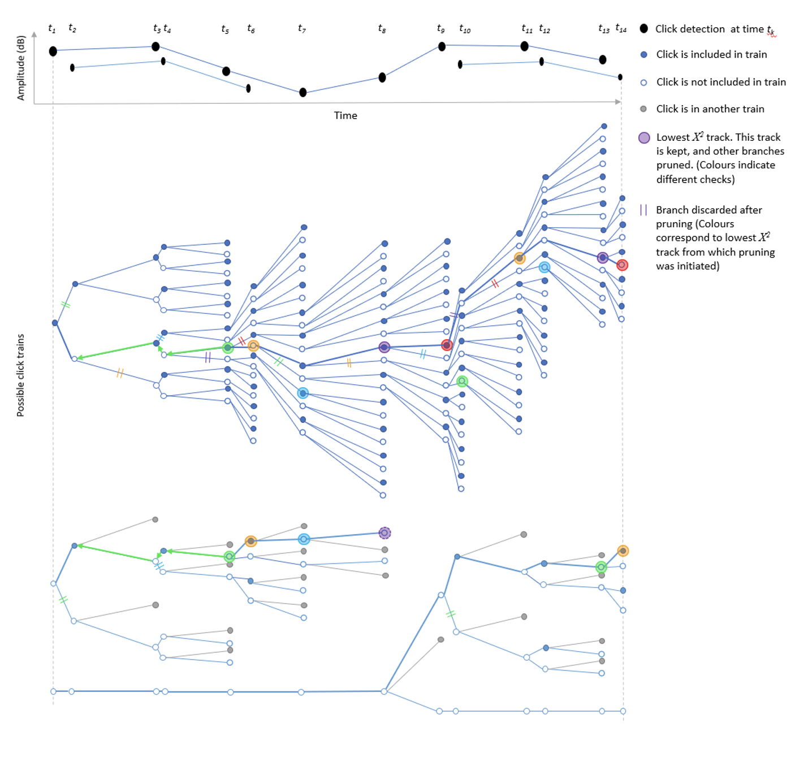
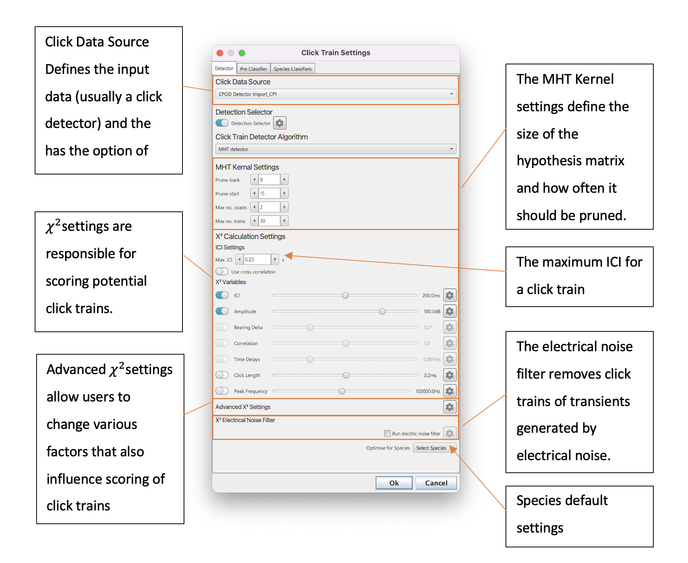

# Click Train Detector

## Overview

When a toothed whale, bat or other echolocator uses echolocation for hunting or sensing their surroundings they usually produce regular clicks/calls which vary slowly in inter-click/call-interval, amplitude, bearing etc. Individual click detections can be difficult to classify from other random transients because recieved waveforms and spectra are distorted by number of factors, such as narrow beam profiles, frequency dependent absorption, propogation effects and animal behaviour. The broadband clicks of many dolphins psecies are especially difficult to distinguish because they are very similar to many other sources of transient noise, such as cavitations from ship propellors. However, the echolocation clicks used by toothed whales (and bats) are not produced in isolation - animals tend to rapidly produce clicks with a slowly varying inter-click-interval (ICI); there are very few non-biological sources which produce regular repetitive sound and so this provides an additional contextual dimension for click classification. An automated algorithm which is based on identifying repeating patterns of sounds therefore has the potential to be significantly more accurate than an algorithm based on identifying individual calls. 

The PAMGuard click train detector module is used to detect and then classify repeating patterns of clicks. It is designed to work with multiple types of acoustic data, from CPOD detections to single channel and multi-channel hydrophone recordings. 

## How it works 

PAMGuard’s click train detector utilises both a detection and classification stage to extract click trains from recordings. 

The detection stage is based on a multi hypothesis tracking (MHT) algorithm. This algorithm considers all possible combinations of transient detections creating a large hypothesis matrix which holds potential click trains. As more clicks are added to the hypothesis matrix it grows exponentially and so, to prevent a computer running out memory, it is regularly “pruned” to keep only the most likely click trains over time. The assigned likelihood of a click train is based on number of properties which can be defined in by the user. For example, a user might select, ICI, Amplitude and Correlation as variables to score click trains; this would mean that combinations of clicks with slowly changing ICI, amplitude and waveforms would be favoured by the algorithm and stay in the hypothesis matrix. Other properties such as bearing, click length and peak frequency can also be selected.  A graphical explanation of the click train detection algorithm is shown in Figure 1 and a more detailed explanation of the be found in Macaulay (2019). 

  

_Diagram demonstrating how the click train algorithm works. Black dots are a set of 14 detected clicks at times t1 to t14. The click train algorithm begins at click 1 and creates two possible clicks trains, one that includes the first click (filled circle) and the other in which the click is not part of the click train (non-filled circle). The algorithm then moves to the next click and adds it to the hypothesis matrix. As the number of clicks increases, the hypothesis matrix exponentially expands in size and must be pruned. After a minimum of Npmin clicks (in this case 4) each track hypothesis (possible click train) is assigned a χ^2score. The track hypothesis with lowest score (defined by larger coloured circles) has it’s branch traced back Np (in this case 3) clicks. Any track hypothesis which do not include the click Np steps back are pruned (defined by the double lines). Clicks which share no click associations with the first track hypothesis are then pruned and the process repeats until all clicks are part of a track or a maximum number of tracks have been considered (in this example there are two tracks). The algorithm then moves to the next click, adds it to the hypothesis matrix, assigns χ^2scores and traces the lowest χ^2 branch Np steps back, pruning the hypothesis  matrix again; the process repeats until the last click. Note that there is always a track hypothesis with no associated clicks (i.e. the bottom-most branch where no clicks belong to a click train). If a track hypothesis is confirmed and thus removed from the hypothesis matrix, then this track can be used to start another click train_

The advantage of this MHT approach is that the click train detection module is quite general and can cope with a large variety of complex situations and multiple overlapping click trains. The disadvantage is that there are a large number of potential variables which can be set that affect the performance of the detector which can make it complex to initially set up.  

The subsequent classification stage attempts to classify detected click trains to species. Classification is currently based on a series of relatively simple binary classification steps but there is scope for machine learning approaches in future versions. The binary classification is based on parameters such as number of detected clicks, the mean and standard deviation in ICI and bearing and the correlation of the average spectrum of the click train with a predefined spectral template. 

A click train which has been both detected and classified is saved to PAMGuard’s database and can be reclassified in PAMGuard’s viewer mode. 

## Configuring the click train detector

The primary settings to configure can be split into MHT Kernel and χ^2 settings – these are all set in the primary click train detector dialog as shown in Figure 2. 

  

_Figure 2. The settings pane of the click train detector._

### MHT Kernel Settings
The MHT Kernel is the part of the detection algorithm which creates and then prunes the large hypothesis matrix which keeps a copy of all possible click trains. MHT Kernel settings are therefore important because they influence speed (a larger number of possible click trains in memory is more processor intensive) and the quality of the detections (the larger the number of possibilities the more likely that “true” click trains are contained in the hypothesis matrix). The specific settings are;

<strong>Prune-back</strong>: The hypothesis matrix needs pruned so that it does not grow exponentially and cause memory issues. The matrix is pruned at Np (see Figure 1) previous detections i.e. if Np is 5 then then then the algorithm selects the most likely click train, moves back five detections back and discards other hypothesis that do not contain the combination of clicks in that branch. Thus, increasing the prune-back means that more hypothesis are kept at any one time but decreasing will lead to faster processing times as less combination are kept in memory. 

<strong>Prune-start</strong>:: The initial number of detections before the pruning process starts. This cannot be less than Prune-back and should generally should be set no more than 15 for 8GB of memory. 

<strong>Max no. coasts</strong>:: A click train is saved and removed the hypothesis mix once it has passed a number of tests. It must be over three clicks long, survive the pruning process and have missed the max no. coasts. A coast is when a click has been missed from a click train based on ICI. i.e. if the ICI is 2s and a click train goes for 6s without a detected click then there have been 3 coasts. Increasing the maximum number of coasts means that click trains are less fragmented but can come at the cost of keeping click trains in the hypothesis matrix for longer which have ended. 

<strong>Max no. trains</strong>:: This is a maximum allowed number of trains in the hypothesis mix. Note this refers to the number of trains which can survive pruning – the actual number of potential click trains in the hypothesis mix will be much larger. Generally, just via pruning, the hypothesis matrix will keep itself below the max no. trains, however, in certain situations it can grow too large and requires a limit. The max no. trains therefore usually have little effect on results but should generally be set to less than 50 to ensure smooth processing  

### χ2 Settings
χ2 is a measure of the likelihood that a click train is from a (usually) biological source. The higher the χ2 value the lower the quality of a click train. 

The χ2 model used in the click train detector considers both the slowly varying properties of click trains, as well as bonus and penalty factors to discourage fragmentation and aliasing (selecting a multiple of the true ICI) of detected click trains. 

The initial basis of the model is: 
	χ^2=∑_(i=1)^m▒((((  ∑_(k=2)^(n-1)▒((〖y_(i,k)- y〗_(i,k-1))-(〖y_(i,k+1)- y〗_(i,k)))^2/〖max⁡(q_i (t_(k+1)-t_k ),〖qt〗_i )〗^2 ))⁄n))⁄m	Eq. 1

where m is the number of selected descriptors, e.g. ICI, amplitude, bearing etc., and y_(i,k) is the measurement of descriptor i for click k in a click train with n associated clicks.  t_(k+1) is the measured time of a click k. Each descriptor is divided by q_i which is a user tuneable parameter that alters the importance each descriptor has on the total χ2. Ideally it should correspond to a prediction of the likely variance of the descriptor. 

The descriptors can be enabled and the variance set in the χ2 Settings pane. The toggle button next to each descriptor sets whether a descriptor is used to score a click train and the variance is then set using the slider or by inputting manually by clicking the settings cog. Increasing the variance means that the descriptor has less of an influence on the calculation of χ2 and decreasing means that the descriptor has a larger influence on χ2.  In some cases, clicks can be so close together that the variance is tiny and thus χ2 becomes huge e.g. during buzzes. A minimum variance value (〖qt〗_i) prevents the variance (〖max⁡(q_i (t_(k+1)-t_k ),〖qt〗_i )〗^2) from falling below very low values. 

Ideally the variance for each parameter would be calculated from a test dataset of manually annotated click trains e.g. by calculating the variance of ICI of all marked click trains.

 
_Figure 3. Each descriptor has a variance setting which can be changed by moving the slider or manually inputting data by clicking the settings button. Variance is multiplied by the ICI for each click detection because clicks closer together in time the descriptor values will change less. In some cases, clicks can be so close together that the variance is tiny and thus χ2 in Eq. 1 becomes huge e.g. during buzzes. A Min. Error prevents the variance from falling below very low values._ 

The available descriptors parameters can be set in the click detector settings pane (Figure 3) and works as follows;

IDI: the inter-detection-interval in milliseconds. The algorithm looks for slowly changes in the interval between detections. 

Amplitude:  the amplitude in dB re 1/muPa pp. The algorithm looks for slowly changing amplitude values. Note that the algorithm is comparing the change in change in amplitude so that the click train algorithm is not biased against large but consistent changes in amplitude (e.g. due to a narrow beam profile sweeping across a hydrophone). 

Bearing: the bearing of multi-channel clicks in degrees. Slowly changing bearings will increase the likelihood that click trains are detected. Note that in a similar way to Amplitude, the change in change in bearing is considered so that the algorithm is not biased against large but consistent changes in bearings. The bearing parameter has some additional settings which apply a large penalty to clicks trains if there is a large (user-defined) jump in bearing. 

Correlation: the algorithm calculates the peak of the cross-correlation value of subsequent clicks and looks for slowly changing values in the cross-correlation value. This tells the click train algorithm to search for clicks with consistent/slowly changing spectra. The correlation descriptor also has some additional settings which allow the user to pre-filter waveforms before cross-correlation. This is especially useful in removing noise from higher frequency detections. 

Time Delays:  the time delay between multi-channel clicks in milliseconds. The algorithm looks for slowly changing values in the time delays between multichannel clicks. This is useful for arrays with more than two hydrophones where an error in a single time delay measurement may cause a substantial error in bearing. Like amplitude and bearing, the time delay values are the change in change in time delays between subsequent clicks to ensure that click trains are not biased against faster changes in bearing. 

Click Length:  the length of the saved waveform of a click in milliseconds. This is a crude measure of the length of a click; however, it can be useful in helping the algorithm distinguish between species with long multi-modal clicks such as sperm whales, and much shorter broadband clicks such as dolphins.

Peak Frequency: the peak frequency in Hz. The peak frequency between subsequent clicks is used score click trains. This is useful for click trains with very stable peak frequencies such as echosounders, narrow band high frequency species and perhaps some beaked whale species. 

### Advanced χ^2 Settings
The descriptors used in Eq. 1 on their own do not provide a good score for click train detections. This is because Eq.1 can achieve the same score by either skipping clicks e.g. every second click in a click train, or by splitting click trains into smaller fragments. 

 
Figure 4. The advanced settings for calculating χ^2. These parameters are primarily used to prevent click train aliasing and fragmentation.
The advanced settings (see Figure 4) are a series of additional factors that prevent aliasing and fragmentation and work as flows; 

Low ICI Bonus: if the median ICI of the possible click train is above a specified maximum value, a large penalty is added which effectively makes it one of the least likely click trains in the hypothesis matrix. If the median ICI is below the maximum value then χ^2  = 〖(χ^2 (I ̃/max_k⁡〖I_k 〗 ))   〗^LI where I ̃ is the median ICI, max_k⁡〖I_k 〗 is the maximum ICI in the possible click train and LI is the low ICI Bonus. This bonus term favours lower ICI values, preventing aliased click trains. 

Long track bonus: add a bonus factor for longer click trains to prevent fragmentation. This is the total length of the click train in seconds divided by the total hypothesis matrix time in seconds L which is then multiplied so that χ^2  = 〖(χ^2 L)   〗^LT  where LT is the long track bonus. 

Long track bonus: add a bonus factor for longer click trains to prevent fragmentation. This is the total length of the click train in seconds divided by the total hypothesis matrix time in seconds L which is then multiplied so that χ^2  = 〖(χ^2 L)   〗^LT  where LT is the long track bonus. 

Coast penalty: add a penalty for “coasting” i.e. when an expected click, based on ICI, is not present in the click train. This penalty is multiplied by the number of coasts i.e. the likely number of missed clicks based on ICI  

New Track Penalty: if a track hypothesis is newly added in the hypothesis matrix, then add a minor penalty factor. This is added until the number of click trains exceeds No. New Track Clicks

