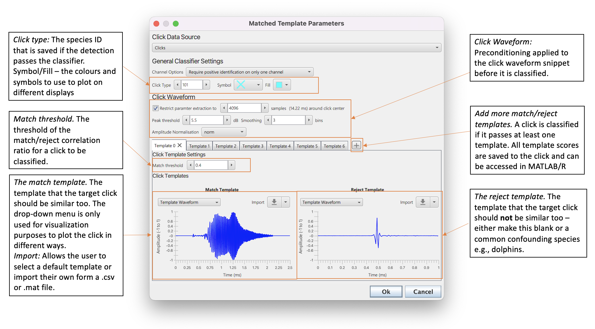

# Matched click classifier

## Overview

The matched click classifier is an alternative to the in built click classifier in the click detection module which uses two click templates (target and reject) to classiify individual clicks detections from the click detection module. The idea behind this classifier is to more accurately classify rarer clicks when there 

## How it works

The classifier is based on a matched filter i.e. a canditate click detection is compared to a template and it's maximum correlation value with the template is then used for classification. Each click is compared to both a _match_ and a _reject_ template. If the ratio of the correlation match to the reject template exceeds a certain threshold then the click is classified. There can be multiple combinations of match to reject templates allowing the matched classifier to deal with with different types of clicks or even clicks from multiple species.

## Configuring the matched click classifier

The matched click classifier seetings are accessed via **Settings-> Matched click classifier**_. The settings are split into the three sections, general settings, click waveform and click templates. 

  

_The settings pane of the matched click classifier_

### General Settings

The general settings allows for channel options, species ID and the default colours for classified clicks to be to be set. 
_
Channel Options _allows users to define whether a single clcik from one channel, all clicks or an averaged click should be used to be used for classification in multi-channle situations. if there is only one channel then this makes no difference. 

_Click Type_ sets the number that defines the species ID. Make sure this is not the same as any mof the species IDs in the default click classifier (this is why the default is set so high). 

_Symbol_ and _Fill_ define the default colours clicks which have been classified by the matched click classifier should be plotted on displays. 

###  Click Waveform Settings

Before a click is classified it undergoes some pre-conditioning by the matched click classifier. 

_Restrict paramter extraction to XX samples_ sets the maximum lengthm of the waveform to the classifier. If this is selected then center of the click is located and samples trimmed around the center. In some use cases, for example SoundTrap detections, which may be 10,000 samples long, setting a lower number of maximum samples can greatly increase processing speed and imporove the accuracy of results. 

_Peak threshold_ and _Smoothing_ are both paramters used to find the click center to set the maximum number of samples. The click length is measured by calculating the waveform envelope using a Hilbert Transform. The envelope is smoothed using a moving average filter (the Smoothing paramter defines the size of the averaging window). The click is trimmed as follows. First the peakof the waveform enevelop is found. The length of the click is defined as the point at which the click falls peak theewshold dB below the peak. The center of the click is then the middle of this snippet. The click is then trimmed from the center of the click. 

_Amplitude normalisation_ If there is a very loud click compared to a template it's correlation score will be different to that of a very quiet click of with exactly the same waveform. It is therefore a good idea to normalise the waveform before it is compared the match click classifier. The types of normalsiation are 
* _norm_ - this is the default - the click is divided by it's RMS amplitude. 
* _peak to peak_ this can be useful for some types of shorter click e.g. dolphins - the click is divided by it's peak to peak amplitude.
* _none_ no normalisation (not recomended).
 
###  Template settings

The matched click classifer has two templates, a match and a reject. The match template should match a stereotypical click of the target species and the reject template can either be a click from a confounding species (e.g. dolphin) or blank. Selecting the drop down menu form the _Import_ button allows for a selection of some default templates. Custom templates can be imported by selecitng the _Import_ button. Custom templates can either be a .csv. or .mt file using the following format. 

**.csv** - the first _row_ are the waveform measurments from -1 to 1 (make sure you save with a sifficient number of decimal points). The second row and first column is the sample rate in sample per second.

**.mat** - a .mat file that contains two variables named _sR_ and _waveform_. _sR_ is the sample rate in samples per second and _waveform_ is a 1D array containing the waveform for the tmeplate form -1 to 1. 

The match and reject templates are plotted to provide a the user with some visualisation of the classifier settings - the drop down menu allows the user to select different ways to plot the templatw and is purely for visualisation purposes and makes no difference to classifier settings. 

_threshold_ is the threshold at which a click is classified. If the ratio bvetween the match and reject templates is above the _threshold_ value then the 
click is classified. 

The + button can be used to add more tabs. Each tab contains a click/rejct template pair and unique threshold setting. A click is classified if at least one of the match/reject templates passes it's set threshold. 

## Visualising Results

The matched click classifier changes the speciesID flag of a click if at least one of the classifiers passes threshold. This means clicks can be visualised in the click bearing time display or the time base display. The classifier also saves the correlation values for each match/reject tmeplate pair which can be accessed in MATLAB/R or through the PAMGuard GUI. 

### Click bearing time display

### Time base display

### Extracting correlation values using MATLAB/R. 

