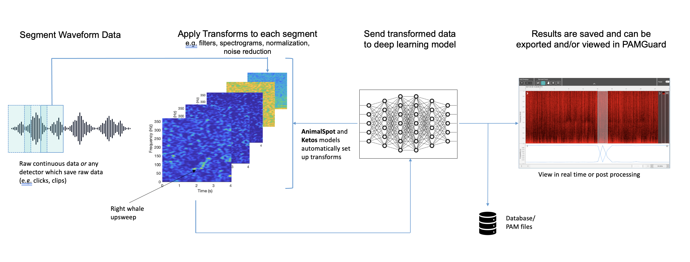
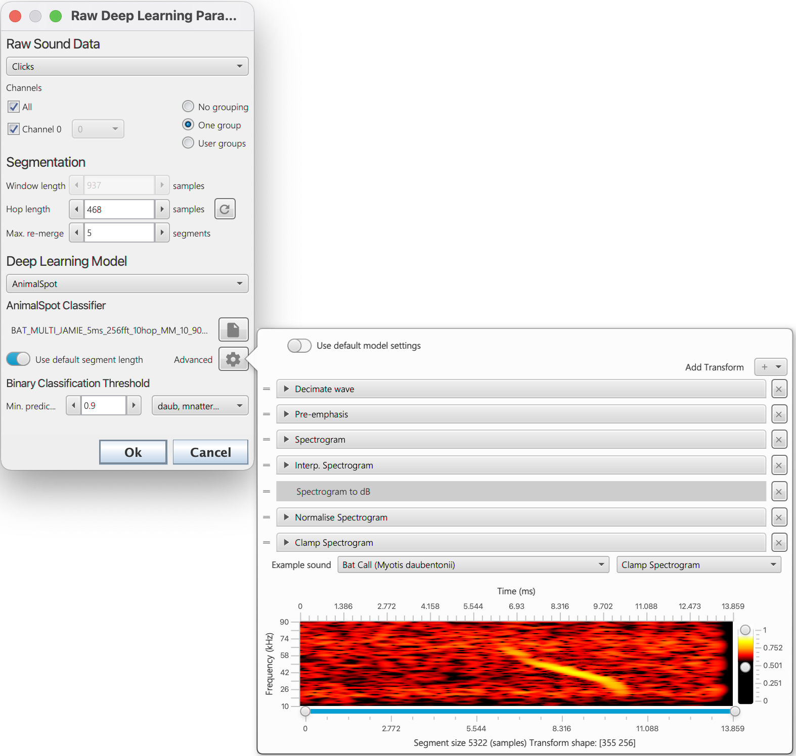

# PAMGuard's deep learning module

## Overview

PAMGuard's deep learning module allows users to deploy a large variety of deep learning models natively in PAMGuard. It is core module, fully integrated into PAMGuard's display and data management system and can be used in real time or for post processing data. It can therefore be used as a classifier for almost any acoustic signal and can integrate into multiple types of acoustic analysis workflows, for example post analysis of recorder data or used as part of real time localisation workflow. 

## How it works

The deep learning module accepts raw data from different types of data sources, e.g. from the Sound Acquisition module, clicks and clips. It segments data into equal sized chunks with a specified overlap. Each chunk is passed through a set of transforms which convert the data into a format which is accepted by the specified deep learning model. These transforms are either manually set up by the user or, if a specific type of framework has been used to train a deep learning model, then can be automatically set up by PAMGuard. Currently there are three implemented frameworks

<p align="center">
  
</p>

_A diagram of how the deep learning module works in PAMGuard. An input waveform is segmented into chunks. A series of transforms are applied to each chunk creating the input for the deep learning model. The transformed chunks are sent to the model. The results from the model are saved and can be viewed in real time (e.g. mitigation) or in post processing (e.g. data from SoundTraps)._

### Generic Model
A generic model allows a user to load any model compatible with the [djl](https://djl.ai/) (PyTorch (JIT), Tenserflow, ONXX) library and then manually set up a series of transforms using PAMGuard's transform library. It is recommended that users use an existing framework instead of a generic model as these models will automatically generate the required transforms. 

### AnimalSpot
[ANIMAL-SPOT](https://github.com/ChristianBergler/ANIMAL-SPOT) is a deep learning based framework which was initially designed for [killer whale sound detection]((https://github.com/ChristianBergler/ORCA-SPOT)) in noise heavy underwater recordings (see [Bergler et al. (2019)](https://www.nature.com/articles/s41598-019-47335-w)). It has now been expanded to a be species independent framework for training acoustic deep learning models using [PyTorch]( https://pytorch.org/) and Python. Imported AnimalSpot models will automatically set up their own data transforms and output classes. 

### Ketos
[Ketos](https://meridian.cs.dal.ca/2015/04/12/ketos/) is an acoustic deep learning framework based on Tensorflow and developed by [MERIDIAN]( https://meridian.cs.dal.ca/). It has excellent resources and tutorials and Python libraries can be installed easily via pip. Imported Ketos model will automatically set up their own data transforms and output classes. 

## Creating an instance of the module
The module can be added from the _File>  Add modules > Classifier > Raw deep learning classifier_ menu or by right clicking in the data model. More than one instance of the module can be added if multiple deep learning models are required. 

## Module settings
The module settings are opened by selecting the  _Settings > Raw deep learning classifier_ menu. The main settings pane is shown below and is split into three sections, _Raw Sound Data_, _Segmentation_ and _Deep Learning Model_

<p align="center">
  
</p>

_The main settings pane for the deep learning module with descriptions_

### Raw Sound Data

The deep learning module accepts any raw data source i.e., any data source that contains raw waveform data.

If the data is continuous, e.g. from the Sound Acquisition module then deep learning detections are saved to PAMGuard's data management system if they pass a user defined prediction threshold. The raw waveform data for segments which pass prediction threshold is saved and the detection is annotated with the deep prediction results. 

If the data source is an existing detection data stream, e.g. clicks or clips, then the deep learning results are saved as an annotation attached each detection. The data is segmented in exactly the same way as continuous data and thus, depending on the length of raw data within the detection, there can be more than one prediction per detection.

Channel grouping controls are used to arrange channels into groups. Channels in the same group are saved together for downstream processes. So, for example if channels 0 and 2 are in a group, then the raw waveform data from both channel 0 and 2 will be saved and can be used in downstream processes, e.g., for localisation. 

### Segmentation

The segmentation section defines how the raw data is segmented. Some deep learning models require a specific segment size and others can be run with different segment sizes. The _Window Length_ is the size of the segment in samples. The _Hop Length_ is the overlap (from the start of the segment) in samples. A _Hop Length_ which is the same as the segment length means no overlap. If a prediction passes threshold, then the raw data from segments is saved to PAMGuard binary files. If concurrent segments pass a prediction threshold, then they are saved as one data unit. The _Max. re-merge_ is the maximum number of segments that can form a single data unit before a new data unit is automatically created. 

### Deep Learning Model 

The deep learning model section is used to select the deep learning model. The drop down menu is used to select the framework the model is from e.g. Generic model. Note that each model type has a unique user interface which appears just below the drop down menu -  currently these all look fairly similar. 

All frameworks require a model file to be selected using the browse button (File icon). A wait icon will appear and the model will be loaded. If the deep learning model loading is successful then the filename of the model will appear (e.g.  saved_model.pb)

_Note: when a model is first loaded, the computer must be connected to the internet as PAMGuard will download the correct libraries for the computer to open the specific model. On Windows machine these libraries are found in a hidden folder called ai.djl. in the user account folder._

Once the model has loaded there some unique options depending on the currently selected framework. 

#### Generic Model

A generic model must be set up via the _Advanced_ menu button. 

<p align="center">
  
</p>

_Before a sound segment can be classified it must be converted into a format suitable for the deep learning model. This is achieved by a list of *transforms* which convert a raw sound data into an appropriate format. Usually this involves converting to a spectrogram image and then performing a series of noise reductions and interpolation step. For the generic model users either have to manually add transforms and input the correct settings for each, or load a transforms *.pgtr setting file_

The _Model Transforms_ tab in the advanced menu pane allows a user to set up a set of transforms. The _Add transfrom_ + button adds a transforms and these can be dragged in order using the drag handles on the left of each transform. Each transform has it's own settings pane which can be expanded to show transform specific settings. The bottom of the advanced settings pane shows a preview of the data that will be input into the deep learning model, including the shape of the input data e.g. a 100x50 image. 

<p align="center">
  
</p>

_The Model Settings tab allows the model inputs and outputs to be defined_

The _Model Settings_ tab allows the model input shape and output shape/classes to be defined. Most models will have metadata on the input and output data and these can be set by selecting the  _Use default model shape_ and _Use default model out_ switches respectively. Otherwise,  the input and output shape and the output classes must be defined manually

The import and export buttons on the bottom of the advanced settings pane can be used to export and import settings for the generic model. This means that users do not have to manually set up transforms and input and output data whenever settings up a new PAMGuard data model and allow easier sharing of classifiers amongst researchers. 

#### AnimalSpot and Ketos models

If using an AnimalSpot or Ketos model then all transforms are automatically set up. The transforms can be viewed and altered via the Advanced menu button but in the majority of cases these settings should not be used. It is advisable to select "Use default segment length" to change the _Window length_ to the default for the selected model. Note that this is often necessary for Ketos models but usually not a requirement for AnimalSpot models. 

<p align="center">
  
</p>

_An AnimalSpot or Ketos model will automatically create a list of transforms with the appropriate settings. These is no need to use the advanced pane but it is there in case users wish to change transform settings for some reason_

## Running
### Real time
In real time, the deep learning model runs automatically when processing starts. A warning will appear if there are issues with the model and/or it cannot cope with real time speeds. 

### Viewer Mode
The deep learning module can be re-run on _detector_ data (e.g. click or clip detections) in PAMGuard _viewer_ mode. Detections can be reclassified by selecting the _Settings > Raw Deep Learning Classifier > Reclassify detections_. Select the data range in the reprocessing dialog e.g. Loaded Data and select _Start_. Detections without a deep learning annotation will have one added and detections with an existing annotation will have it overwritten. 

## Viewing and exporting results
Output from the deep learning module can be viewed in PAMGuard viewer mode, or extracted from binary files using MATLAB or R. 

### PAMGuard viewer mode
Detections form continuous raw data are shown in the datagram in the same way as all data streams in PAMGuard.

The Time base display FX is best way to view detailed data outputs from the deep learning algorithm. The time base display can display almost all data types in PAMGuard on a large variety of different data axis. For example, click detections can be displayed on an amplitude, bearing, ICI, waveform and/or frequency axis. Deep learning detections (i.e. data units which have been saved from raw data using the deep learning detector) can be displayed on the time base display in the same way as many other detections and in addition, there is a symbol manager options which allows the deep learning detections or other detections which have been classified by the deep learning module to be coloured by prediction class. This means that a manual analyst can quickly navigate to detections with high prediction values for a certain class. Hovering over or right clicking on a data unit in the time display and selecting the information button, will show the data unit’s metadata, including the prediction values for all output classes from the deep learning model. 

<p align="center">
  
</p>

_An example click detection module output coloured by deep learning annotations. Click detections are annotated with the results from the deep learning module. The symbol manager in the time base display can be used to colour the clicks by the prediction for a selected class_

Other displays also show outputs from the deep learning module. Hovering over data units in the click display will, for example, show deep learning prediction values. The spectrogram will also show deep learning detections as translucent blue boxes (these must be selected in the right click menu). 

### MATLAB 
The easiest way to export to MATLAB is to select the desired units in the time base display, right click and select the MATLAB icon. Data units will be exported to a .mat file as list of structures which is then saved to the clipboard. This file can be saved and then dragged into MATLAB to open. 

Where it is necessary to further analyse large datasets produced by PAMGuard, there is a MATLAB-PAMGuard library which can directly import the binary files which store PAMGaurd detection data. The library is simple to use with the primary function being ```loadPAMGuardBinaryFile.m. ``` This will load any binary file type (e.g. clicks, whistles, deep learning detections) and return a list of data structures with the detection data. The structures include annotations where deep learning predictions are stored. 

Here is a simple example loading up all the deep learning detections for a right whale classifier. 

```matlab
% the folder containing PAMGuard binary files
folder = '/Users/me/right_whale_project_1/PAMBinary/'; 
 
 %load all the detections in the folder
dldetections = loadPamguardBinaryFolder(folder, 'Deep_Learning_Classifier_Raw_Deep_Learning_Classifier_DL_detection_*.pgdf')
```
The predicitons for each class (in this case the classes are noise and right whale) are easily accessed in the structure via;

```matlab
%% access the prediciton form the first detection 
predicitons = dldetections(1).annotations.dlclassification(j).predictions;

```

The loaded detections can then be plotted by accessing the waveform data in each structure;

```matlab

% plot all the spectrograms.
clf
tiledlayout(5,5)
for i=1:length(dldetections)
    
    nexttile
    
    % generate the data for a spectrgram
    [s, w, t] = spectrogram(dldetections(i).wave,512, 384,[],sR,'yaxis');
    
    % create the time and frequency matrices required to plot a surface 
    [X, Y] = meshgrid(t,w);
    % plot the surface (divide and multiply by 1000 to show milliseconds and kHz respectively)
    surf(X*1000, Y/1000, 20*log10(abs(s))-140, 'EdgeColor', 'None')
    view([0,90])
 
    caxis([70, 140]-140)  
    ylim([0,0.5]); 
    xlabel('')
    ylabel('')
    
    if (mod(i,5)==0)
       c = colorbar;  
       c.Label.String = 'Amplitude (dB)'; 
    end
 
    %x axis only on bottom plots
    if (i>=20)
       xlabel('Time (ms)') 
    end
    
    %y axis only on left most plots
    if (mod(i-1,5)==0)
       ylabel('Frequency (kHz)') 
    end
```

<p align="center">
  
</p>

_Right whale detections from a deep learning model imported and then plotted in MATLAB_

### R
In the same way as MATLAB export, the PAMGuard time base display and export selected data units directly to an R struct which can be imported easily into R.. 

R also has a well supported PAMGuard library with like for like functions compared to the MATLAB library. The PAMBinaries R library can be found [here](https://github.com/TaikiSan21/PamBinaries).

## Common bugs and mistakes
The first time you use the module and/or load a different type of model e.g. a tensorflow or pytorch model, you must be connected to the internet. 

You must install the correct version of CUDA for hardware acceleration using an Nvidea GPU. See the currently supported CUDA versions on the Pytorch and Tensorflow websites. 

You should always have deep learning models in their own folder. Do not have any additional jar files or other programming related things (like .dll files) in the same or sub folders. This has been known to cause issues with loading models which we have not got to the bottom of yet. 

Pytorch models must be saved using jit to be compatible with PAMGuard. 

Tensorflow models must be saved as .pb files to be opened in PAMGuard.  


